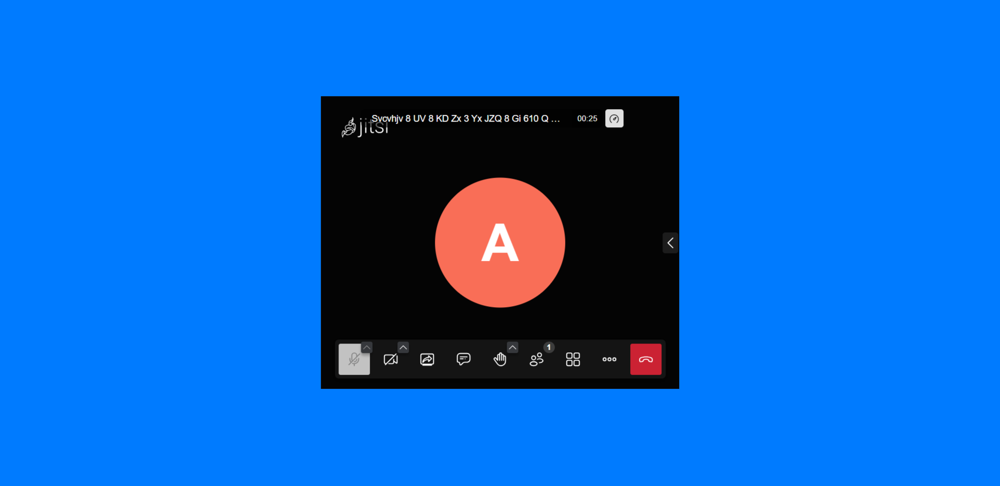

<h1 align="center">
  Video Conference App
</h1>

<h3 align="center">
  Web Application | HTML CSS
</h3>

  

Video Conference Demo App is a comprehensive repository that showcases the development of a video conferencing application similar to Zoom, using the Jitsi API. This project aims to provide developers with a practical example of integrating video conferencing capabilities into their own applications, demonstrating the potential of real-time communication technology.
The Video Conference Demo App utilizes the powerful features of the Jitsi API, allowing users to initiate video conferences, communicate with participants via audio and video, and share screens for collaborative discussions. The application provides a user-friendly interface that facilitates seamless navigation and interaction, ensuring a smooth and engaging video conferencing experience.
  
With the focus on demo purposes, this application imposes a time limitation, automatically ending the meeting after 5 minutes. This restriction allows users to explore the core functionalities and get a glimpse of how the video conferencing features can be implemented within their own projects.
The repository provides a well-organized structure, with clear and concise documentation guiding developers through the setup and integration process. The code is modular and thoroughly commented, making it easy to understand and customize according to specific project requirements.
  
This repository serves as a valuable resource for developers looking to incorporate video conferencing capabilities into their own applications. By exploring and analyzing the code and documentation, developers can gain insights into the implementation of real-time communication features using the Jitsi API and adapt them to their specific project needs.
Overall, the Video Conference Demo App repository offers an opportunity to dive into the world of video conferencing technology and understand the fundamentals of building a similar application. It empowers developers to explore the potential of real-time communication, fostering collaboration and connectivity in the digital realm.

  
<!-- ................................................................................................................................. -->

### Features
 
Following are some of the new features and learning encountered while creating this amazing project:

- Real-time video conferencing: Experience high-quality audio and video communication in real-time, enabling participants to engage in virtual meetings and discussions.
- Screen sharing: Enhance collaboration by sharing screens, allowing participants to present slideshows, demonstrate software applications, or showcase other visual content.
- Chat functionality: Facilitate instant messaging and communication during video conferences, enabling participants to exchange text-based messages and links.
- User-friendly interface: The application features an intuitive and visually appealing interface, making it easy for users to navigate and interact with different functionalities.
- Time-limited meetings: The demo version of the app restricts meetings to 5 minutes, providing a glimpse of the capabilities while serving as a demonstration of the integration and functionality.

  
<!-- ................................................................................................................................. -->

### Demo

  The Demo of this working project can be found on  
  <a href="https://rebrand.ly/VideoConferenceApp_MABCORP">rebrand.ly/VideoConferenceApp_MABCORP</a>

  
<!-- ................................................................................................................................. -->

### Application's Interface  

  
<!-- ................................................................................................................................. -->

### Technology Stack
 
Follwing technologies have been used at the core of this application to make it stand in the market place:

- HTML
- CSS
- Web API

  
<!-- ................................................................................................................................. -->

### Advancement

> Nothing Recommended Yet

  
<!-- ................................................................................................................................. -->

### Deployment Details

The website is deployed using the free hosting provided by **Vercel**

  

  
Later on the link was customized using the well-known URL shortener and customizer **Rebrandly**:  

  

  
<!-- ................................................................................................................................. -->

### Developer

Muhammad Abdullah Butt  
abdullahbutt12292210@gmail.com  
> [Instagram](https://www.instagram.com/abdullah.butt.22/) 
> [FaceBook](https://www.facebook.com/profile.php?id=100076291614529) 
> [YouTube](https://www.youtube.com/channel/UCnuOFQyMywg-KuoN-lmav1Q) 
> [Portfolio](https://rebrand.ly/MuhammadAbdullahButt_MABCORP) 
> [Project Displayer]( https://rebrand.ly/ProjectDisplayer_MABCORP)
  
<!-- ................................................................................................................................. -->

